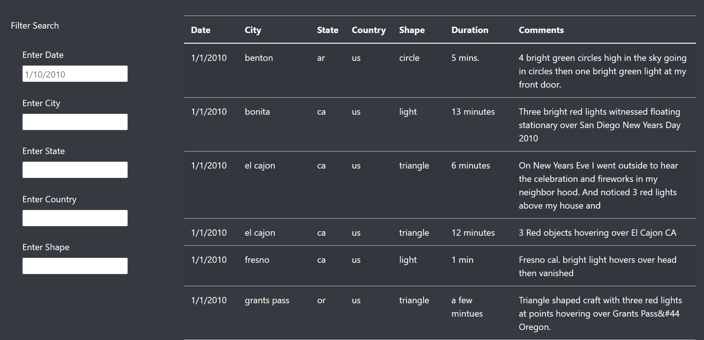
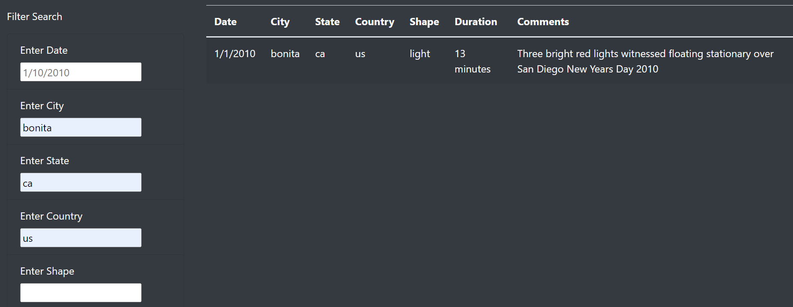

# UFOs
## Overview
The purpose of this analysis is to make a website that can use multiple filters at the same time to sort the table by Date, City, State, Country, and Shape. This was done by creating a function to loop through the data and only keep the results that match the search criteria. 
.
## Results
To use the new web page is actually very simple. You can simply type in what you are searching for in the filters, then the table will display that information as long as it is in the Data.

.

## Summary
A drawback to this design is for example; if you were to look for a state city and date and one of those filters do not match the data. It automatically will not bring in the information. So lets say you wanted benton, AR on 1/2/2010. It would automatically not show you anything because there is not data for that specific date. Overall I would say this is a pretty good design because you don't need to use all the filters and you can get what you want out of it. A recommendation I have is that we might as well have a filter for duration as well. I understand the way they are all written a little different would make it difficult to search, but it could be useful to some users. The other recommendation would be to add links to any articles that are related to the sightings, so if people wanted to dig into any of them more. 
